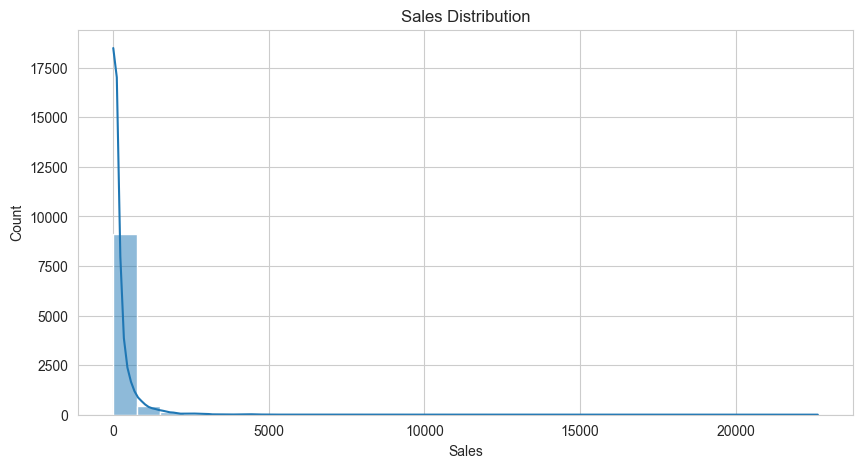

# Superstore Sales EDA



## Project Overview
This project performs Exploratory Data Analysis (EDA) on the Superstore Sales dataset to identify meaningful business insights, customer purchasing patterns, product performance, and regional sales trends using Python data analysis and visualization libraries.

The analysis helps in understanding sales behavior and supports data-driven business decision-making.

---

## Objectives
- Analyze overall sales distribution
- Understand category and sub-category performance
- Compare sales across different regions
- Identify monthly sales trends
- Visualize important business insights using graphs

---

## Technologies Used
- Python
- Pandas
- NumPy
- Matplotlib
- Seaborn
- Jupyter Notebook

---

## Dataset Information
The dataset contains supermarket sales records including:
- Order Details
- Customer Information
- Product Categories
- Sales Data
- Regional Information
- Shipping Details

Key columns used in analysis:
- Category
- Sub-Category
- Region
- Sales
- Order Date
- Ship Date

---

## Project Workflow

### 1. Data Collection
- Imported dataset from Kaggle
- Loaded CSV dataset using Pandas

### 2. Data Cleaning
- Checked missing values
- Removed duplicate records
- Converted date columns into datetime format

### 3. Feature Engineering
- Extracted Year, Month, and Day from Order Date

### 4. Exploratory Data Analysis
Performed analysis on:
- Sales Distribution
- Region Wise Sales
- Product Categories
- Sub Categories
- Monthly Sales Trends

### 5. Data Visualization
Used Matplotlib and Seaborn to create visual representations of business trends and sales patterns.

---

## Visualizations Included
- Sales Distribution Histogram
- Region Wise Sales Bar Chart
- Product Category Analysis
- Sub-Category Analysis
- Monthly Sales Trend Line Chart

---

## Key Insights
- Office Supplies category contains the highest number of products.
- Binders and Paper are the most frequently occurring sub-categories.
- East and South regions show comparatively higher average sales.
- Monthly sales vary significantly across the year.
- Most transactions are low-value sales with a few high-value outliers.

---

## Conclusion
This project successfully applied Exploratory Data Analysis techniques to understand product demand, sales behavior, and regional performance within the Superstore dataset.

The visualizations and insights generated from this analysis can help businesses improve strategic planning, inventory management, and sales decision-making.

---

## Folder Structure

```text
EDA_Supermarket_Sales/
│
├── data/
│   └── supermarket.csv
│
├── images/
│   ├── sales_distribution.png
│   ├── region_sales.png
│   ├── category_analysis.png
│   ├── subcategory_analysis.png
│   └── monthly_sales.png
│
├── notebooks/
│   └── supermarket_eda.ipynb
│
└── README.md
```